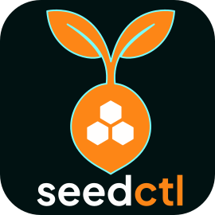

<!-- markdownlint-disable MD033 -->
<!-- markdownlint-disable MD041 -->

  

**SeedCTL** is a deterministic, offline-first multichain wallet generator.

## Official page

[https://orbitbits.com/seedctl/](https://orbitbits.com/seedctl/)

## Canonical Documentation

The full and up-to-date documentation is hosted at:

- **Docs Hub**: [https://orbitbits.com/seedctl/documentation](https://orbitbits.com/seedctl/documentation/)

## ⚠️ SECURITY WARNING

SeedCTL does NOT store, transmit, or recover private keys.

Loss of mnemonic phrases or private keys will result in permanent loss of funds.

Use this software at your own risk.

For technical and operational details, always prefer the docs links above.

## Repository

- GitHub: [https://github.com/orbitbits/seedctl](https://github.com/orbitbits/seedctl)
- GitLab Mirror: [https://gitlab.com/orbitbits/seedctl](https://gitlab.com/orbitbits/seedctl)

## LICENSE

Official license: [GNU General Public License v3.0 only](https://github.com/orbitbits/seedctl/blob/main/LICENSE).
